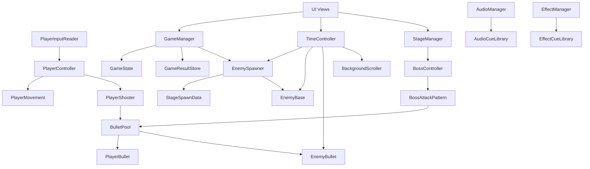

# Chrono Shooter ポートフォリオ仕様書

作成日: 2026-06-19  
対象プロジェクト: Chrono Shooter  
想定成果物: Webポートフォリオ内の作品紹介ページ、または単体のケーススタディページ

## 1. 目的

Chrono Shooter のゲーム内容、制作意図、技術的な工夫、担当範囲を整理し、閲覧者が短時間で作品の魅力と実装力を理解できるポートフォリオページを制作する。

ポートフォリオでは、完成物の見た目だけでなく、時間操作システム、敵出現制御、ボス戦、UI、音声・エフェクト管理など、ゲームとして成立させるための設計と実装を伝える。

## 2. 作品概要

| 項目 | 内容 |
| --- | --- |
| タイトル | Chrono Shooter |
| ジャンル | 2D縦スクロールシューティング |
| 制作環境 | Unity 6000.4.3f1 |
| 使用言語 | C# |
| 主なパッケージ | Unity Input System、UGUI、TextMesh Pro、2D Feature Set |
| 操作デバイス | キーボード、マウス、ゲームパッド |
| 主要シーン | TitleScene、GameScene、GameOverScene、GameClearScene |
| コア体験 | スローゲージを使って敵や敵弾の時間だけを遅くし、弾幕を回避しながら戦う |

## 3. ポートフォリオで伝える主題

### 3.1 一言コンセプト

時間を操って弾幕を切り抜ける、2Dスペースシューティングゲーム。

### 3.2 訴求軸

- スローゲージによる時間操作を中心にしたゲームデザイン
- プレイヤー、敵、敵弾、背景スクロールに異なる時間スケールを適用する実装
- ScriptableObject を使ったステージ出現データ管理
- 敵弾の大量生成に対応する ObjectPool 実装
- 通常敵フェーズからボス戦へ進むゲーム進行管理
- 結果画面、ポーズ、設定、BGM/SE、エフェクトまで含めた一連のゲーム体験

## 4. 想定閲覧者

| 閲覧者 | 知りたいこと | 見せるべき内容 |
| --- | --- | --- |
| 採用担当者 | 作品の完成度、担当範囲、制作姿勢 | 冒頭の短い動画、概要、担当範囲、制作期間、成果 |
| エンジニア | 実装設計、コード品質、技術選定 | システム構成、時間制御、ObjectPool、ScriptableObject |
| ゲーム制作関係者 | 遊びの面白さ、調整のしやすさ | スローゲージ、敵パターン、ボス戦、UIフィードバック |
| 一般閲覧者 | どんなゲームか、面白そうか | スクリーンショット、短い説明、操作方法、プレイ動画 |

## 5. ページ全体方針

### 5.1 トーン

SF、スピード感、緊張感、時間操作を感じるデザインにする。  
暗い宇宙背景に、シアン、赤、白、紫などの差し色を使い、ゲーム画面の印象と合わせる。

### 5.2 情報設計

ファーストビューでは作品名、ジャンル、短いコンセプト、プレイ中のビジュアルを見せる。  
その後、ゲーム概要、特徴、技術解説、制作プロセス、素材・クレジット、今後の改善案の順に展開する。

### 5.3 ページ形式

単体作品ページとして成立する縦長構成を基本とする。  
ポートフォリオ一覧から遷移した場合でも、ページ冒頭だけで作品の内容が伝わる構成にする。

## 6. 推奨ページ構成

### 6.1 Hero

目的: 作品の第一印象を作る。

掲載内容:

- タイトル: Chrono Shooter
- サブコピー: 時間を操り、弾幕を切り抜ける2Dシューティング
- 短い説明文: スローゲージを消費して敵や敵弾の速度を落とし、通常敵フェーズからボス戦までを攻略するUnity製2Dシューティングゲーム。
- メインビジュアル: ゲームプレイ中のスクリーンショット、または15秒程度のプレイ動画
- メタ情報: Unity / C# / 2D Shooter / Input System

推奨CTA:

- Play Demo
- Watch Gameplay
- View Source

CTAは公開状況に応じて表示する。未公開の場合は `Gameplay Video` と `Project Details` を優先する。

### 6.2 Project Summary

目的: 作品の概要を短く説明する。

掲載内容:

| 項目 | 表示内容 |
| --- | --- |
| ジャンル | 2D縦スクロールシューティング |
| プラットフォーム | PC想定 |
| エンジン | Unity 6000.4.3f1 |
| 言語 | C# |
| 入力 | キーボード、マウス、ゲームパッド |
| 主な実装 | 時間操作、敵AI、弾管理、ボス戦、UI、音声、エフェクト |

### 6.3 Gameplay

目的: 実際の遊びを説明する。

掲載内容:

- `WASD` または矢印キーで移動
- `Space` または左クリックでショット
- `Left Shift` でスロー発動
- `Esc` でポーズ
- ゲームパッドでは Left Stick、South Button、Left Trigger、Start に対応

説明するゲームループ:

1. プレイヤーが敵弾を避けながらショットで敵を倒す。
2. スローゲージを消費して敵の移動、敵弾、背景スクロールを遅くする。
3. 通常敵フェーズを突破するとボスが登場する。
4. ボスのHP割合に応じて攻撃パターンが変化する。
5. プレイヤーが倒れると Game Over、ボスを撃破すると Game Clear。
6. 結果画面でスコア、撃破数、プレイ時間、被弾数を表示する。

### 6.4 Core Feature

目的: Chrono Shooter らしさを強調する。

#### 時間操作システム

スローゲージを消費して敵側の時間スケールを下げる。プレイヤー操作は通常速度のまま維持し、敵、敵弾、敵の出現タイマー、背景スクロールに `TimeController.EnemyDeltaTime` と `TimeController.EnemyFixedDeltaTime` を使うことで、回避と攻撃の判断時間を作る。

実装上の要点:

- `TimeController` がゲージ、最大値、消費量、回復量、スロー状態を管理
- スロー中は `EnemyScale` を `slowScale` に変更
- 敵弾 `EnemyBullet` は `TimeScale` を `TimeController.EnemyScale` に上書き
- プレイヤー弾は通常速度のまま動作
- ゲージが尽きると自動的にスロー解除
- スロー開始時にSEを再生

ポートフォリオ上の見せ方:

- 通常速度とスロー中の比較GIFまたは動画
- ゲージUIが減る様子
- 敵弾だけが遅くなり、プレイヤーが動けることを強調するキャプション

### 6.5 Enemy and Boss Design

目的: ゲーム進行と敵バリエーションを示す。

通常敵:

| 敵 | 役割 | 実装 |
| --- | --- | --- |
| NormalEnemy | 下方向に進みながら直線弾を撃つ基本敵 | `EnemyBase` を継承し、移動と攻撃を上書き |
| ChaseEnemy | プレイヤーを追尾する接近型 | プレイヤーを探索し、方向を向いて移動 |
| CircleShotEnemy | 全方向に弾を撃つ弾幕型 | 指定数の弾を円形に発射 |

ボス:

- 通常敵フェーズ終了後に登場
- 登場時は弾を消去し、警告演出を表示
- HP割合に応じて攻撃パターンを切り替える
- HP 70%以上: プレイヤー狙い撃ち
- HP 40%以上: 12方向円形弾
- HP 40%以下: 16方向円形弾と追尾系ショット
- 撃破時は爆発、煙、落下、フェード演出を経てゲームクリア

### 6.6 Stage System

目的: データ駆動設計を説明する。

`StageSpawnData` は ScriptableObject として敵出現ルールを保持する。

出現ルールに含まれる情報:

- enemyId
- enemyPrefab
- startTime
- endTime
- spawnInterval
- maxAlive
- minViewportX / maxViewportX
- spawnViewportY

現在のステージデータ:

| 敵 | 開始 | 終了 | 出現間隔 | 最大同時数 |
| --- | ---: | ---: | ---: | ---: |
| NormalEnemy | 0秒 | 5秒 | 2秒 | 6 |
| ChaseEnemy | 0秒 | 5秒 | 3秒 | 3 |
| CircleShotEnemy | 0秒 | 5秒 | 4秒 | 2 |

ポートフォリオでの表現:

- 「コードを書き換えずに敵出現タイミングを調整できる」点を説明する
- ScriptableObject の構造図または Inspector スクリーンショットを掲載する

### 6.7 System Architecture

目的: 実装全体の関係性を視覚化する。

### 6.8 Technical Highlights

目的: 技術力を伝える。

掲載する技術ポイント:

| 技術要素 | 内容 | アピールポイント |
| --- | --- | --- |
| 時間制御 | 敵側の deltaTime を独自スケールで制御 | `Time.timeScale` に頼りすぎず、プレイヤー操作と敵側の時間を分離 |
| ObjectPool | 弾プレハブごとに `ObjectPool<BulletBase>` を管理 | 弾幕生成時の Instantiate / Destroy 負荷を軽減 |
| ScriptableObject | ステージ出現データ、音声キュー、エフェクトキューをデータ化 | 調整しやすく再利用性が高い |
| 状態管理 | Ready / Playing / Paused / Cinematic / GameOver / GameClear | ゲーム進行、ポーズ、演出中の制御を整理 |
| UIイベント連携 | スコア、HP、ボスHP、時間ゲージをイベントで更新 | UI更新処理とゲームロジックを分離 |
| 設定保存 | BGM、SE、明るさを PlayerPrefs に保存 | ユーザー設定をシーン間で維持 |
| 音声管理 | BGMフェード、SEクールダウン、ミキサー対応 | 音の重なりや音量調整を制御 |

### 6.9 Screenshots and Media

目的: 作品の見た目と流れを直感的に伝える。

必要素材:

| 素材 | 用途 | 推奨内容 |
| --- | --- | --- |
| Hero動画 | 冒頭の訴求 | 15秒から30秒。スロー、敵弾、ボスを含める |
| タイトル画面 | UI紹介 | TitleScene の全体 |
| 通常戦闘 | Gameplay紹介 | 通常敵3種類とショット |
| スロー発動比較 | Core Feature | 通常速度とスロー中を並べる |
| ボス登場 | 演出紹介 | Emergency表示とボス出現 |
| ボス戦 | Gameplay紹介 | HPに応じた弾幕変化 |
| リザルト画面 | 完成度紹介 | スコア、撃破数、時間、被弾数 |
| ScriptableObject画面 | 技術紹介 | StageSpawnerData の Inspector |
| コード抜粋 | 技術紹介 | TimeController、BulletPool、StageSpawnData |

### 6.10 Visual Design Requirements

目的: ポートフォリオページの見た目を定義する。

レイアウト:

- ファーストビューはゲーム画面を大きく見せる
- 技術説明はスクリーンショット、コード抜粋、短い説明の組み合わせにする
- 作品概要、担当範囲、技術スタックは表で整理する
- 長い説明文だけの構成にせず、要点を短いブロックに分ける

配色:

- 背景: 深い宇宙系の黒、濃紺
- アクセント: シアン、赤、紫、白
- 警告表現: ボス登場演出に合わせた赤
- 文字: 高コントラストの白または淡いグレー

タイポグラフィ:

- 見出しはSF感のある太めのフォント
- 本文は読みやすいサンセリフ
- 数値やメタ情報は等幅風の表現も可

注意:

- 装飾よりもゲーム画面を主役にする
- 宇宙背景やエフェクトで文字の可読性を落とさない
- スマートフォンでも動画、表、コードが崩れないようにする

## 7. 掲載コピー案

### 7.1 短い紹介文

Chrono Shooter は、スローゲージで敵や敵弾の時間を遅くしながら戦う Unity 製 2D シューティングゲームです。通常敵を突破するとボス戦に突入し、HPに応じて変化する弾幕を攻略してゲームクリアを目指します。

### 7.2 技術紹介文

敵側の移動、攻撃、弾、背景スクロールに独自の時間スケールを適用し、プレイヤーの操作感を保ったまま弾幕だけを遅くする仕組みを実装しました。弾の生成には ObjectPool を利用し、ScriptableObject によって敵の出現タイミングや音声、エフェクトをデータとして管理しています。

### 7.3 担当範囲の表記案

- ゲーム企画、ルール設計
- プレイヤー操作、ショット、HP、無敵時間
- スローゲージと時間制御
- 敵3種類とボス攻撃パターン
- 弾の ObjectPool
- ステージ進行と敵出現データ
- スコア、HP、ボスHP、リザルト、設定UI
- BGM、SE、エフェクト管理
- シーン遷移とゲーム状態管理

## 8. 実装済み機能一覧

| カテゴリ | 機能 | 実装状況 |
| --- | --- | --- |
| プレイヤー | 移動、ショット、HP、被弾無敵、死亡演出 | 実装済み |
| 入力 | キーボード、マウス、ゲームパッド対応 | 実装済み |
| 時間操作 | スローゲージ、消費、回復、敵側時間スケール | 実装済み |
| 敵 | 通常敵、追尾敵、円形弾敵 | 実装済み |
| ボス | 登場、HP、移動、段階別攻撃、死亡演出 | 実装済み |
| 弾 | プレイヤー弾、敵弾、ボス弾、ObjectPool | 実装済み |
| ステージ | ScriptableObject による出現ルール | 実装済み |
| UI | HP、スコア、ボスHP、時間ゲージ、ポーズ、結果 | 実装済み |
| 音声 | BGM、SE、フェード、音量設定 | 実装済み |
| エフェクト | 被弾、撃破、煙、ボス演出 | 実装済み |
| 設定 | BGM音量、SE音量、明るさ保存 | 実装済み |

## 9. ファイル構成の紹介

ポートフォリオの技術説明で引用しやすいファイル:

| ファイル | 説明 |
| --- | --- |
| `Assets/Scripts/TimeSystem/TimeController.cs` | スローゲージと敵側時間スケール |
| `Assets/Scripts/Core/GameManager.cs` | ゲーム状態、スコア、結果保存、開始・終了処理 |
| `Assets/Scripts/Player/PlayerController.cs` | 入力から移動とショットを制御 |
| `Assets/Scripts/Player/PlayerHealth.cs` | HP、被弾、無敵、死亡演出 |
| `Assets/Scripts/Enemy/EnemyBase.cs` | 敵共通処理、移動、攻撃、撃破 |
| `Assets/Scripts/Enemy/EnemySpawner.cs` | 敵出現管理 |
| `Assets/Scripts/Stage/StageSpawnData.cs` | 敵出現ルールの ScriptableObject |
| `Assets/Scripts/Boss/BossController.cs` | ボスのHP、移動、攻撃段階、死亡演出 |
| `Assets/Scripts/Boss/BossAttackPattern.cs` | ボス弾幕パターン |
| `Assets/Scripts/Bullet/BulletPool.cs` | 弾の ObjectPool 管理 |
| `Assets/Scripts/Bullet/EnemyBullet.cs` | 敵弾への時間スケール適用 |
| `Assets/Scripts/Core/AudioManager.cs` | BGM、SE、フェード、音量制御 |
| `Assets/Scripts/Effects/EffectManager.cs` | エフェクト再生管理 |

## 10. ポートフォリオページ要件

### 10.1 必須要件

- 作品名とジャンルがファーストビューで分かる
- プレイ画面の画像または動画を冒頭に掲載する
- スロー機能の魅力が1分以内に理解できる
- 技術スタックを明記する
- 担当範囲を明記する
- 操作方法を簡潔に掲載する
- 技術的な工夫を3項目以上掲載する
- 素材・ライセンスに関する注意書きを掲載する

### 10.2 推奨要件

- 30秒以内のゲームプレイ動画を埋め込む
- 通常速度とスロー中の比較GIFを掲載する
- ボス戦のスクリーンショットを掲載する
- GitHub リポジトリへのリンクを掲載する
- WebGLビルドまたはダウンロードリンクを掲載する
- 制作で苦労した点と改善した点を記載する

### 10.3 非対象

- ゲーム本体の新規機能追加
- ランキング、オンライン要素、セーブデータ拡張
- 素材ライセンスの最終確認作業
- WebGLビルドの軽量化

## 11. 制作プロセスとして書ける内容

### 11.1 課題

シューティングゲームでは敵弾が増えるほど画面が忙しくなり、初心者にとって回避が難しくなる。単に弾数を減らすと緊張感が落ちるため、プレイヤーが自分の判断で難所を切り抜けられる仕組みが必要だった。

### 11.2 解決策

プレイヤーの操作速度は維持したまま、敵側の移動や弾速だけを遅くするスローゲージを実装した。これにより、弾幕の緊張感を残しつつ、プレイヤーがタイミングを見極めて反撃する余地を作った。

### 11.3 工夫

- `Time.timeScale` 全体変更ではなく、敵側ロジックに専用 deltaTime を適用
- プレイヤー弾は通常速度、敵弾はスロー対象に分離
- 弾の生成負荷を抑えるため ObjectPool を導入
- 敵出現データを ScriptableObject 化し、調整しやすくした
- ゲーム進行状態を明確に分け、ポーズや演出中の処理を制御

### 11.4 学び

- ゲームの手触りは、入力、時間制御、UIフィードバックの組み合わせで決まる
- シューティングでは弾の生成と破棄が多いため、早い段階でプール化しておくと拡張しやすい
- ScriptableObject によるデータ管理は、ステージ調整や演出差し替えに向いている

## 12. クレジット・ライセンス表記

ポートフォリオには、以下のような表記を入れる。

使用素材には Unity Asset Store 由来のアセット、TextMesh Pro 付属リソース、Open Font License のフォント、生成画像が含まれます。各素材はそれぞれのライセンスに従って使用しています。リポジトリ自体のライセンスは未設定です。

掲載候補:

- 2D Space Kit
- Tiny Space Ships
- Free 2D Impact FX
- Space Game GUI kit
- Sci-fi GUI skin
- War FX
- FREE Power Music for Awesome Games
- Asap / Righteous
- TextMesh Pro resources

注意:

一部SE、BGM素材は正式な配布ページ、作者名、ライセンス表記の追加確認が必要。公開ポートフォリオに素材クレジットを掲載する前に、README の `Assets to Confirm` を確認する。

## 13. 今後の改善案として掲載できる内容

- WebGLビルド対応
- 難易度選択
- スローゲージの回復アイテム
- ステージ数の追加
- ボス攻撃パターンの増加
- スコア評価ランク
- リザルト画面の詳細化
- チュートリアル表示
- 画面解像度や入力設定の追加
- 敵出現データの複数ステージ化

## 14. 公開前チェックリスト

- [ ] プレイ動画を撮影する
- [ ] 通常速度とスロー中の比較素材を用意する
- [ ] タイトル、戦闘、ボス、リザルトのスクリーンショットを用意する
- [ ] GitHub リポジトリの公開範囲を決める
- [ ] 素材クレジットを最終確認する
- [ ] WebGLビルドを公開するか決める
- [ ] 制作期間、担当範囲、使用ツールを確定する
- [ ] README とポートフォリオ本文の内容に矛盾がないか確認する
- [ ] スマートフォン表示で表と動画が崩れないか確認する

## 15. 推奨完成イメージ

完成ページは、以下の順番で読み進められる構成にする。

1. 作品名とゲーム画面で興味を引く。
2. どんなゲームかを短く説明する。
3. スローゲージという独自要素を動画で見せる。
4. 敵、ボス、リザルトまでのゲーム流れを見せる。
5. 技術的な工夫を図とコード抜粋で説明する。
6. 担当範囲と制作プロセスを明記する。
7. クレジットと今後の改善案で締める。

## 16. 参考にする既存ドキュメント

- `README.md`: ゲーム概要、操作方法、素材クレジット
- `ProjectSettings/ProjectVersion.txt`: Unity バージョン
- `Packages/manifest.json`: 使用パッケージ
- `ProjectSettings/EditorBuildSettings.asset`: 登録シーン
- `Assets/Data/Stages/StageSpawnerData.asset`: 現在の敵出現ルール

